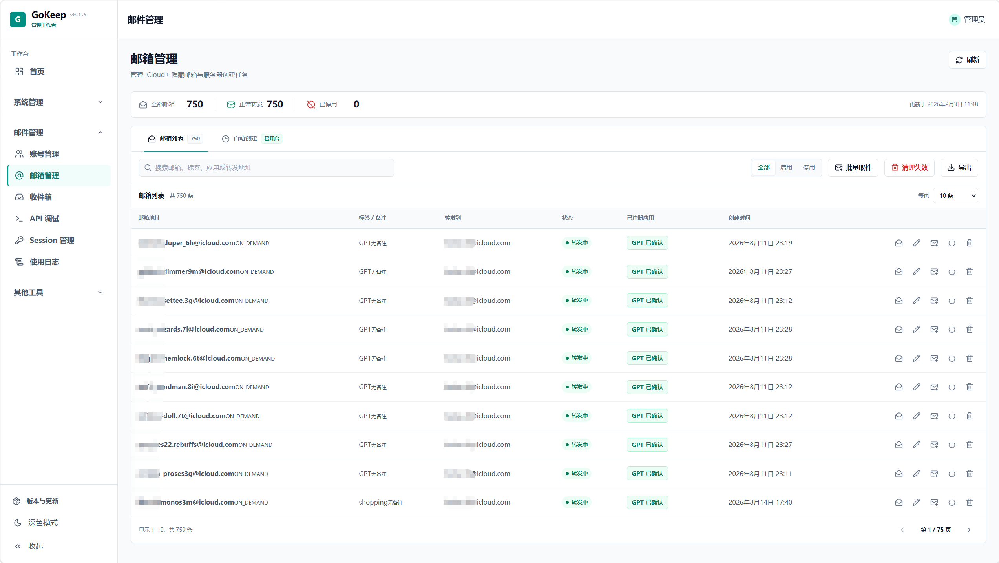
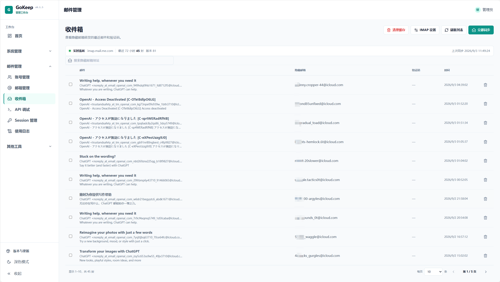
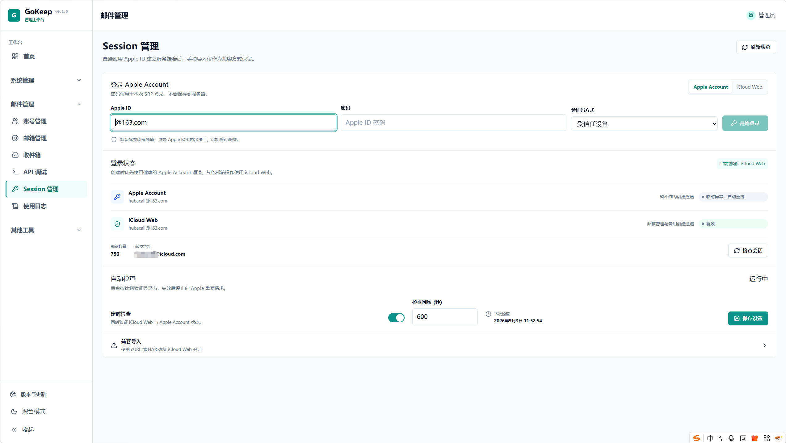

# GoKeep 邮箱管理系统

GoKeep 是面向 iCloud+ Hide My Email 的多账号邮箱管理系统。项目将原 GoKeep 管理后台的用户、角色、菜单和权限能力，与 hme-tools 的 iCloud 会话、隐藏邮箱、共享收件箱及 IMAP 邮件处理能力整合为一套前后端分离的管理平台。

> Apple Account 与 iCloud Web 均依赖 Apple 的网页接口，接口或风控策略变化可能影响登录和邮箱操作。请仅管理你有权使用的账号。

## 界面预览

| 邮箱管理 | 收件箱 | Session 管理 |
| --- | --- | --- |
|  |  |  |

## 业务能力

### 账号与网络

- 管理多个 iCloud 母号，并为每个账号维护独立的运行状态和当前操作上下文。
- 为不同账号单独配置 HTTP、HTTPS 或 SOCKS5 代理，支持代理连通性测试。
- 导入 iCloud Web Session，查看会话健康状态并按计划自动检查、刷新。
- 使用 Apple Account 的 SRP 流程登录，支持双重认证（2FA）；登录密码只参与当次认证，不写入服务器持久化数据。

### Hide My Email

- 分页查看隐藏邮箱别名，创建、启用、停用或删除别名。
- 编辑别名标签和备注，并导出 CSV。
- 根据可信 IMAP 邮件证据标记 GPT 已注册或已确认状态，并按该状态筛选别名。
- 配置定时自动创建计划，也可立即执行或暂停任务；创建队列由后端持久化管理。
- 创建单个或批量公开收件箱分享链接，支持按 GPT 注册状态批量选择、撤销和清理失效分享。

### 收件箱

- 配置并测试 iCloud IMAP 连接，执行邮件同步和长轮询。
- 查看最近收件、指定别名的邮件列表与邮件详情，并从正文中提取验证码。
- 隐藏单封或批量邮件，并清理本地邮箱缓存。
- 通过公开分享链接只读访问授权别名的最近邮件。

### 运维与辅助工具

- 按账号查看邮件模块使用日志，支持关键字、级别、分类、来源、时间范围和分页筛选。
- 在已登录会话中调试邮箱 API，并生成可直接运行的 cURL 命令。
- 使用保本测算工具计算账号成本、保本倍率、目标利润售价和额度换算；测算数据仅在浏览器内处理。
- 在界面中查看当前版本、检查新版本，并在符合条件的 Linux 生产环境中发起自动更新。

## 平台能力

- 登录、邮箱注册、可选邮箱验证码和 Redis 会话管理。
- 用户、角色、菜单、字典、系统设置与 RBAC 权限控制。
- 系统操作日志、数据库备份及运行状态检查。
- 响应式管理后台、暗色主题、动态路由和折叠侧栏。
- 前端静态资源可内嵌到 Go 二进制或容器镜像中部署。

## 技术栈

| 部分 | 技术 |
| --- | --- |
| 前端 | Vue 3、TypeScript、Vite、Pinia、Tailwind CSS、Lucide |
| 后端 | Go 1.25、Gin、Ent |
| 数据 | PostgreSQL 16、Redis 7、持久化数据目录 |
| 工程 | pnpm 11 workspace、Docker Compose、GitHub Actions |

## 项目结构

```text
apps/web/             Vue 管理后台
server/cmd/server/    Go 服务入口
server/internal/mail/ iCloud、Hide My Email、IMAP 与分享业务
server/internal/      认证、系统管理及平台基础设施
deploy/               本地依赖、生产主机与 systemd 更新配置
scripts/              Windows 开发与验证脚本
docs/                 架构、接口、界面和部署规范
```

## 本地开发

### 环境要求

- Go 1.25+
- Node.js 20+
- pnpm 11+
- Docker Desktop（用于启动本地 PostgreSQL 和 Redis）

### 1. 准备配置与依赖

在仓库根目录执行：

```powershell
if (-not (Test-Path .env)) { Copy-Item .env.example .env }
docker compose -f deploy/compose/docker-compose.yml up -d
pnpm install
```

`deploy/compose/docker-compose.yml` 只启动 PostgreSQL 16 和 Redis 7。`.env.example` 中的凭据仅供本机开发，不能直接用于生产环境。

如果本机已经安装 PostgreSQL 和 Redis，可以不运行 Docker Compose，但必须在 `.env` 中填写可用的 `DATABASE_URL`、`REDIS_ADDR` 和 `REDIS_PASSWORD`。数据库账号、数据库名和密码需要与 PostgreSQL 中实际创建的凭据完全一致。

### 2. 启动后端

普通开发启动：

```powershell
powershell -ExecutionPolicy Bypass -File .\scripts\dev-server.ps1
```

需要监听 Go 源码并自动重启时：

```powershell
powershell -ExecutionPolicy Bypass -File .\scripts\dev-hot.ps1
```

### 3. 启动前端

另开一个 PowerShell 窗口，在仓库根目录执行：

```powershell
pnpm dev
```

默认访问地址：

- 管理后台：`http://localhost:5173`
- 后端 API：`http://localhost:8080`
- 存活检查：`http://localhost:8080/healthz`
- 依赖就绪检查：`http://localhost:8080/readyz`

开发环境首次启动会创建管理员账号 `admin / admin123`。登录后必须立即修改默认密码；公开环境不得保留该凭据。

## API 入口

- 管理端基础 API：`/api/v1`
- 需登录的邮箱 API：`/api/v1/mail`
- 公开分享 API：`/share/v1`

分享链接中的邮箱地址和 token 等同于访问凭据，不要写入日志、截图、工单或公开仓库。撤销分享后，原链接将不再可用。

## 验证命令

```powershell
pnpm typecheck
pnpm test
pnpm build

Push-Location server
go test ./...
go vet ./...
Pop-Location
```

## 生产部署

生产环境使用根目录的 `compose.server.yml`。先准备强随机密码与签名密钥，再启动服务：

```bash
cp deploy/host/.env.example .env
# 编辑 .env，替换数据库密码、Redis 密码、JWT_SECRET 和允许的 CORS 来源
mkdir -p data/system data/mail
sudo chown -R 10001:10001 data
sudo chmod 700 data data/system data/mail
docker compose --env-file .env -f compose.server.yml up -d
```

生产服务默认只监听宿主机 `127.0.0.1:8080`，应通过反向代理提供 HTTPS。不要将 Cookie、Apple Account 密码、IMAP 专用密码、API Key、分享 token 或真实邮件正文提交到仓库或输出到日志。

自动更新当前仅支持 Linux 生产主机，需要 Docker、Docker Compose、Python 3、`flock` 和仓库提供的 systemd path watcher。界面发起更新后，宿主机脚本会拉取发布镜像、等待健康检查，并在启动失败时尝试回滚。完整安装和回滚步骤见[部署与运维规范](docs/09-部署与运维规范.md)。

## 开发文档

- [技术栈规范](docs/01-技术栈规范.md)
- [总体架构与目录规范](docs/02-总体架构与目录规范.md)
- [数据库与缓存规范](docs/03-数据库与缓存规范.md)
- [API 接口规范](docs/04-API接口规范.md)
- [前端开发规范](docs/05-前端开发规范.md)
- [UI 设计规范](docs/06-UI设计规范.md)
- [后端开发规范](docs/07-后端开发规范.md)
- [移动端适配规范](docs/08-移动端适配规范.md)
- [部署与运维规范](docs/09-部署与运维规范.md)
